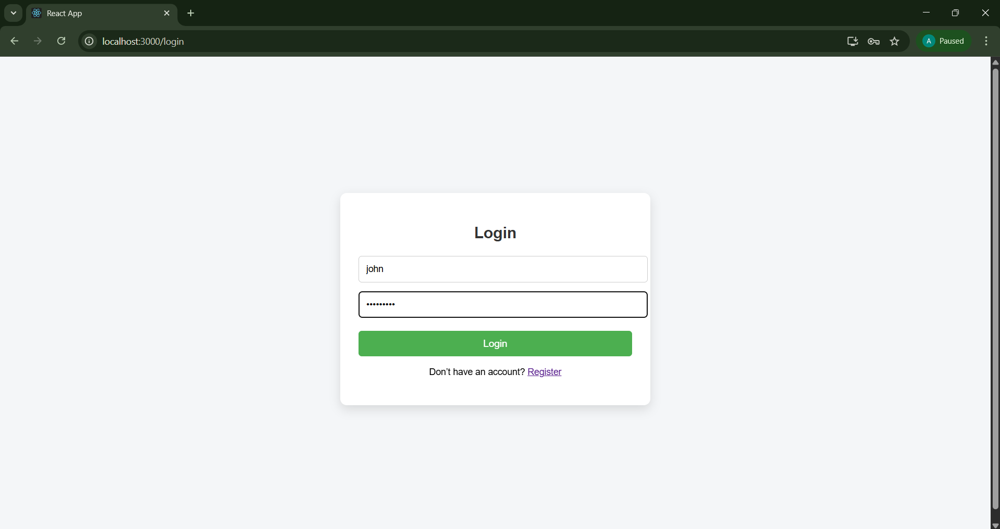
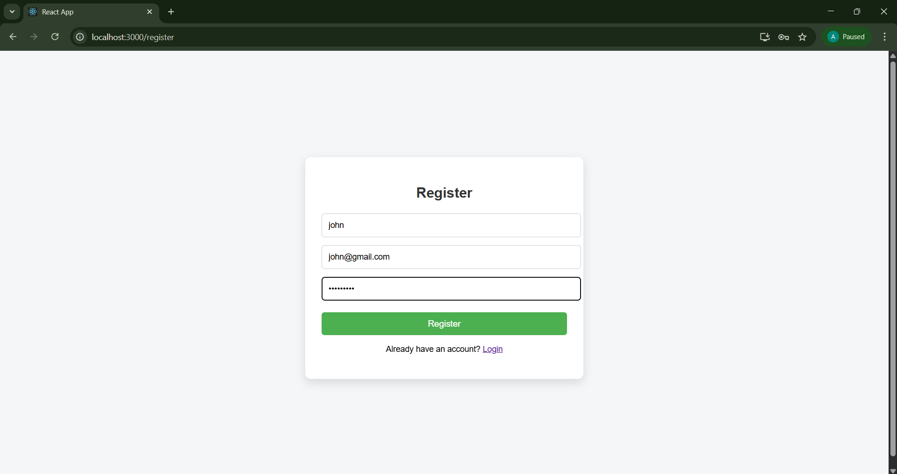
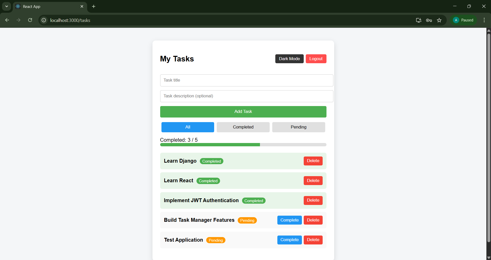
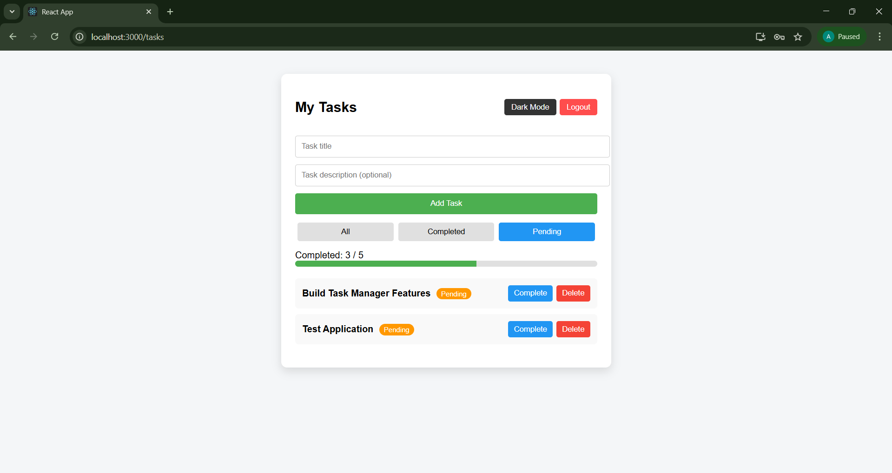
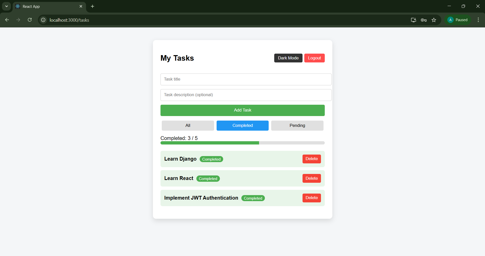
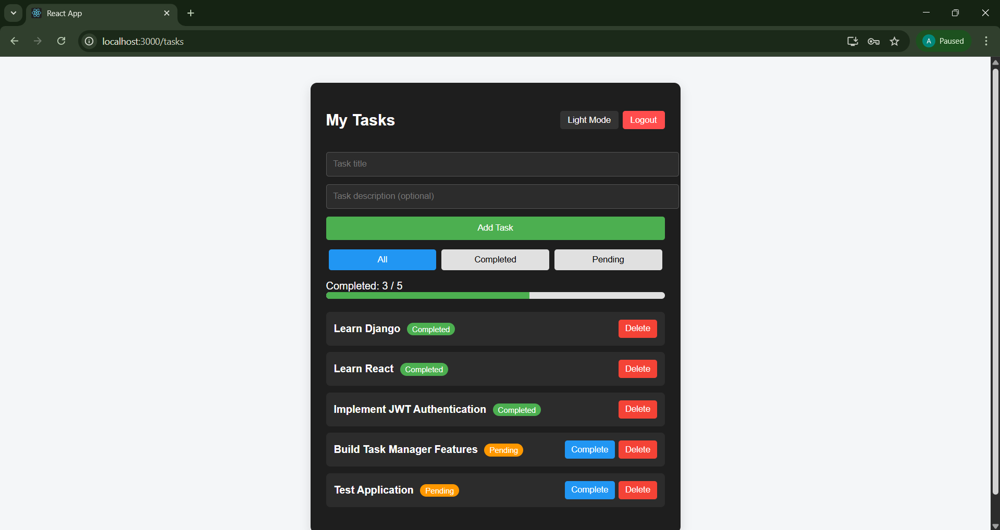
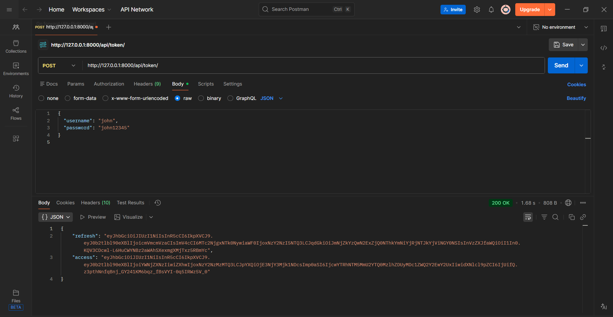
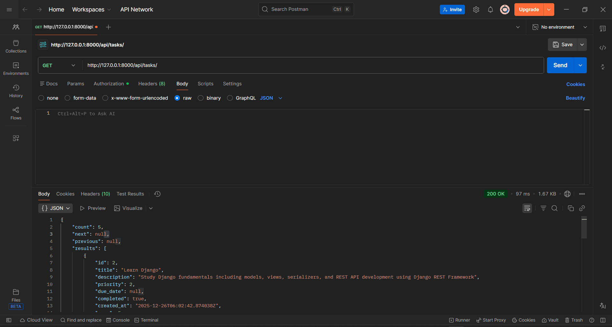

# Task Manager App – Full Stack Project

This project is a **Full Stack Task Manager Application** developed using **Django REST Framework (Backend)** and **React (Frontend)** as part of a **Full Stack Development Internship Task**.

The application allows users to register and log in securely using **JWT authentication** and manage their personal tasks. Password hashing and token-based authentication ensure security. Each authenticated user can create tasks, update task details, delete tasks, and mark tasks as completed. All tasks are private and accessible only to the logged-in user.

---

## Features

### Authentication

- User Registration
- User Login using JWT Authentication
- Secure Logout
- Password hashing

### Task Management

- Add new tasks
- Edit existing tasks
- Delete tasks
- Mark tasks as completed
- View only logged-in user’s tasks

### Filtering & UI

- Filter tasks: All / Completed / Pending
- Pagination for task listing
- Completed task progress bar
- Dark / Light mode toggle
- Clean and responsive UI
- Proper error handling and validation messages

---

## Tech Stack

### Frontend

- React
- Axios
- React Router
- CSS

### Backend

- Python
- Django
- Django REST Framework (DRF)
- JWT Authentication (SimpleJWT)
- django-environ for environment variables
- SQLite (can be switched to PostgreSQL or MySQL)

---

## Project Structure

task-manager/
├── screenshots/
│   ├── _login_page.png
│   ├── _register_page.png
│   ├── _tasks_dashboard.png
│   ├── _pending_task.png
│   ├── _completed_task.png
│   ├── _dark_mode.png
│   ├── _backend_login.png
│   └── _backend_api.png
├── src/
│   ├── backend/
│   └── frontend/
├── venv/
└── README.md

## ✅ Backend Setup

 Follow the steps below to run the Django backend server

### Step 1: Navigate to the backend directory

cd src/backend

### Step 2: Create and activate a virtual environment

python -m venv venv
venv\Scripts\activate

### Step 3: Install backend dependencies

pip install -r requirements.txt

### Step 4: Apply database migrations

python manage.py makemigrations
python manage.py migrate

### Step 5: Start the Django development server

python manage.py runserver

### Step 6: Backend server URL

<http://127.0.0.1:8000/>

## ✅ Frontend Setup

 Follow the steps below to run the React frontend application

### Step 1: Navigate to the frontend directory

cd src/frontend

### Step 2: Install frontend dependencies

npm install

### Step 3: Start the React development server

npm start

### Step 4: Frontend application URL

<http://localhost:3000/>

## ✅ API Endpoints

 All API endpoints are secured using JWT Authentication
 Protected endpoints require a valid access token in the Authorization header

 🔐 Authentication APIs

### User Registration

POST /api/users/register/

### User Login (JWT Token)

POST /api/token/

### Refresh Access Token

POST /api/token/refresh/

## 📋 Task Management APIs (Authenticated)

### Get all tasks (logged-in user only)

GET /api/tasks/

### Create a new task

POST /api/tasks/

### Update a task

PATCH /api/tasks/{id}/

### Delete a task

DELETE /api/tasks/{id}/

## ✅ Evaluation Checklist

✔ User registration and login implemented using JWT authentication

✔ Secure password hashing and token-based authorization

✔ User-specific task access (each user can view only their own tasks)

✔ Complete CRUD operations for tasks (Create, Read, Update, Delete)

✔ Ability to mark tasks as completed

✔ Task filtering by status (All / Completed / Pending)

✔ Pagination implemented for task listing

✔ Clean and responsive user interface

✔ Proper frontend–backend API integration

✔ Error handling and validation messages implemented

✔ Bonus features included (progress bar, dark/light mode toggle)

## Screenshots

### Login Page

### Register Page

### Tasks Dashboard

### Pending Tasks

### Completed Tasks

### Dark Mode

### Backend Login (JWT Token)

### Backend API Response

